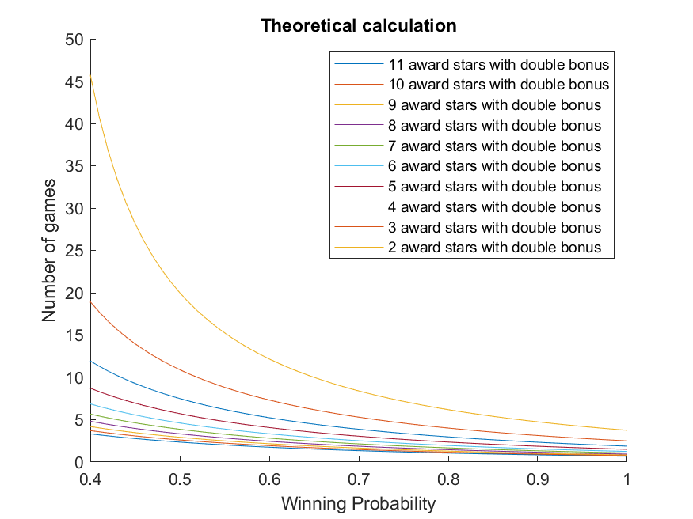
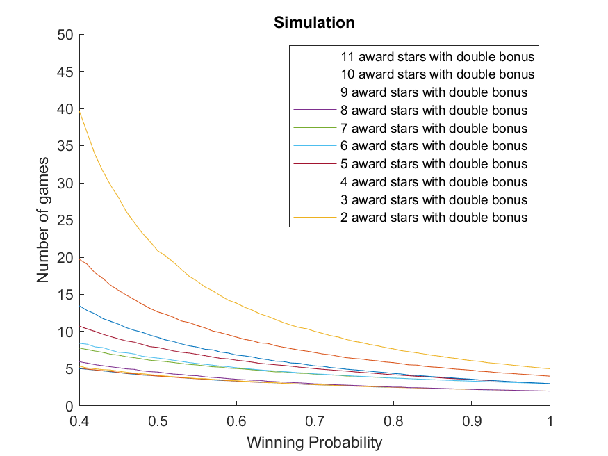
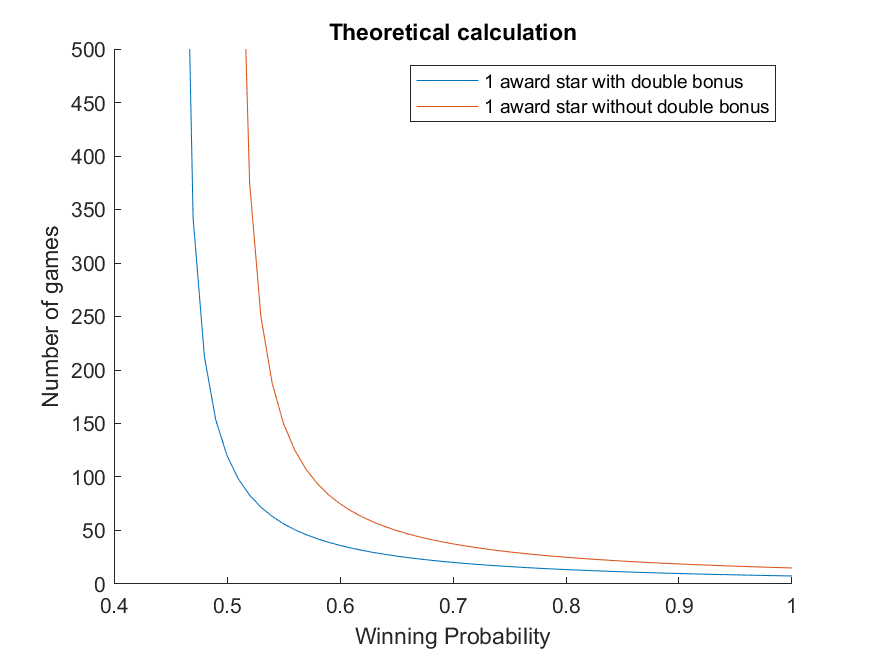
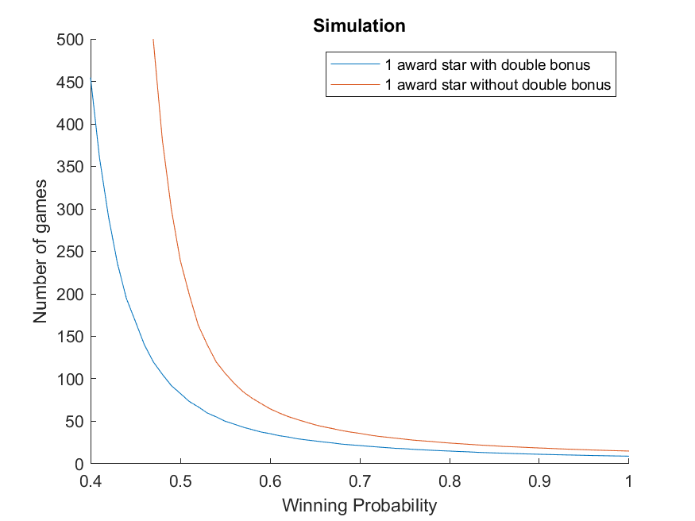

# HS-rankup: How many games you need to play to rank up in HearthStone?

## Project Details

The ranked play of Hearthstone is a serious play mode, where the players are able to earn their ranks to reflect their strength in battle and gain rewards every season.

Players spent lots of time playing games, but get their ranks hardly changed. In this project, I want to estimate how many games a player need to play to get a rank up.

## Rules

There are five groups for Hearthstone ranks: Bronze, Silver, Gold, Platinum and Diamond. Each league has 10 ranks from 10 to 1.

Winning the game will earn players stars, and each rank requires three stars to advance. The number of stars awarded in each game is determined by the star bonus provided at the beginning of each season and the winning streak bonus.

1. Losing the game cause player to lose one star, unless the player is at a rank floor. Rank floor occurs at every 5 ranks, such as silver 5 or gold 10.
2. According to the statistics of the player in previous season, the number of stars obtained in each winning game is ranges from 1 to 11.
3. If the player wins 3 consecutive games, the number of stars awarded doubles. (Applicable to ranks below diamond 5)

## Mathematics

Since there are rank floors for every 5 ranks, I am interested in how many games a player have to play to advance from one rank floor to another. In another words, earn 15 stars. To calculate the expected number of games a player need to play, I can calculated the expected stars a player can earn in each game. To simply the calculation, I ignore the rule for rank floor and assume that the player lose one star when losing. It should not affect much as most of the games happen in the middle of the 5 ranks. 

Assume the probability the player to win the game is p. Let q0 to be the probability that the player currently wins 0 consecutive game and q1 to be the probability that the player currently wins 1 consecutive game, then the the probability that the player currently wins at least 2 consecutive games is q2=1-q0-q1. If the player plays one additional game, the probabilities should remain the same as follows:

$$
q_0=1-p\\
q_1=q_0p\\
q_2=(1-q_0)p
$$
Solve the equations, we have
$$
q_0=1-p\\
q_1=p-p^2\\
q_2=p^2
$$

### With bonus rules

Assume that the player is awarded x stars after wining and the double bonus rule applies. Then, the expected stars earn in each game is
$$
E(s) = xq_0p + xq_1p + 2xq_2p - (1-p) = xp^3 + (x+1)p - 1
$$
If the player can continue to advance, we need that E(s) > 0. Let E(s) = 0, we can solve the functions and get one real number solution, which is the winning probability the player has at least. The expected number of games the player has to play to rank up is
$$
E(t)=15/E(s)
$$

### Without any bonus rule

Assume that the player is simply awarded 1 stars after wining. Then, the expected stars earn in each game is
$$
E(s) = q_0p + q_1p + q_2p - (1-p) = 2p - 1
$$
If the player can continue to advance, we need that E(s) > 0, which indicate p > 0.5. It is not surprise that you need a winning probability to be greater than 0.5 for a fair bonus setting. The expected number of games the player has to play to rank up is
$$
E(t)=15/E(s)
$$

## Simulation

In order to verify my calculation, I also wrote Matlab code to simulate the games played by the player. In the simulations, all the rules applies. Each simulation is repeated 10,000 times, and the result is the averaged value.

## Results

### Least winning probability

The least winning probability the player need to advance is as follows:

| Award stars | Double bonus | Least wining probability |
| ----------- | ------------ | ------------------------ |
| 11          | Yes          | 0.082813                 |
| 10          | Yes          | 0.090241                 |
| 9           | Yes          | 0.099123                 |
| 8           | Yes          | 0.109930                 |
| 7           | Yes          | 0.123358                 |
| 6           | Yes          | 0.140481                 |
| 5           | Yes          | 0.163054                 |
| 4           | Yes          | 0.194146                 |
| 3           | Yes          | 0.239674                 |
| 2           | Yes          | 0.312908                 |
| 1           | Yes          | 0.453398                 |
| 1           | No           | 0.5                      |

With star bonus rules, the players can still get advanced even the winning probability is less than 0.5. It is easy to advance if the number of reward stars is above 1. On the other hand, if the reward star is 1, you still need a winning probability 0.4534 to advance even with double bonus rule.

### Number of games the player need to play

Now I will show the results for the number of games the player need to play to earn 15 stars with bonus rules and without bonus rules.

### With bonus rules

The number of games the player need to play to earn 15 stars with bonus rules are demonstrated as below. The figures shows the averaged number of games the player has to play to earn 15 stars. It is clear that the fewer award stars, the more number of plays. With award stars larger than 1, it is kind of easy to advance even the wining probability is smaller than 0.5. Thus, extra award stars is a great benefit in the ranked play. The theoretical calculation and simulation are very similar. The difference might come from that I ignored the rule of rank floor.

### Without double bonus rule

The number of games the player need to play to earn 15 stars without double bonus rule are presented as below. The figures shows the averaged number of games the player has to play to earn 15 stars. Compared with previous results, much more game are needed to advance. Theoretically, you can only advance with a least winning probability. However, the simulation results show that the player can still advance even if the expected star earned is negative. It is because that there is rank floor rule and it is always possible to get advanced with any winning probability. Note that, the number of games increases dramatically while the winning probability decreases.

## Conclusion

Some interesting conclusions can be drawn based on the theoretical calculation and simulation. With bonus rules, the players can get quickly advanced even the winning probability is just 0.4. Without the bonus rules, the players might need a winning probability of 0.55 to get quickly advanced. Otherwise, much more games are needed.
